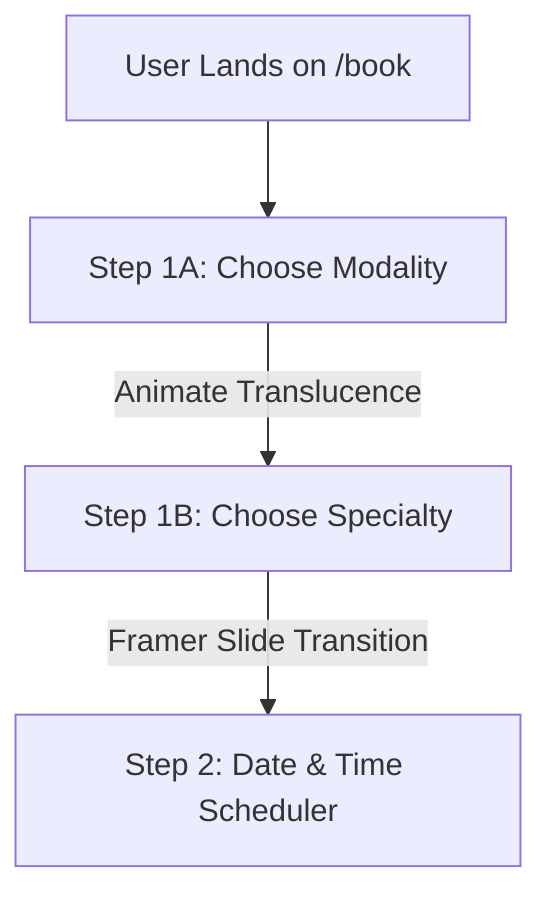

# Refined Implementation Plan — Book Appointment Page Redesign

**Auditor/Designer:** Anti-Gravity (Senior UX & Engineering Partner)  
**Target:** Redesign the `/book` page (specifically Step 1 and Step 2 of the Booking Wizard) to elevate the overall score from a **5.8/10** to a **10/10**.  
**Scope:** Focus solely on this page/step context (Modality selection, Specialty selection, and transition progression).

---

## Goal Description

The current Booking Wizard Step 1 conflates Modality Selection (In-Clinic vs. Virtual) and Medical Specialty Selection on a single scrolling page. This results in heavy cognitive load, options hidden below the fold, layout stretching issues when displaying a small list of specialties, and a dead-end sticky action bar. 

This plan details a comprehensive redesign that splits these choices into sequential, animated sub-steps, integrates our premium glassmorphic system, and adds motion orchestration to deliver a state-of-the-art booking experience.

---

## User Review Required

We are focusing 100% on the `/book` wizard page. The core architectural decision is **introducing sub-stepping to Step 1**:

> [!IMPORTANT]
> **Sub-Step Separation:** Instead of showing both Modality cards and the Specialty list together on one page, Step 1 will be divided into:
> * **Step 1A:** Modality selection (In-Clinic vs. Virtual) in a clean, vertical-centered viewport.
> * **Step 1B:** Specialty selection, which smoothly slides in *only* after a modality is chosen.

---

## Proposed Changes (Integrating Opencode Redesign Spec v1.0)

### Component: Booking Wizard Redesign

We will modify the core React component and its CSS module to implement the new design.

#### [MODIFY] [BookingWizard.tsx](file:///c:/Users/Swift%20America/Desktop/Redisign%20of%20Maryland%20Website/Redesign%20of%20Maryland%20Website/app/book/BookingWizard.tsx)
* **Sub-Step State Machine:**
  * Add a `subStep` state (`"modality" | "specialty"`) within Step 1 to partition choices sequentially.
  * Adjust the "Back" button handler so that clicking back during Step 1.2 takes the user back to Step 1.1, rather than disabling it.
* **Specialty Card Balancing:**
  * Constrain card dimensions in the specialty grid (max-width `340px`) and center the grid when fewer items are available (like Virtual's 2 specialties), resolving the horizontal stretching.
* **Animated Transition Sequences:**
  * Wrap components in Framer Motion `<AnimatePresence>` blocks. 
  * Apply horizontal sliding transitions (`initial={{ opacity: 0, x: 24 }}`, `animate={{ opacity: 1, x: 0 }}`, `exit={{ opacity: 0, x: -24 }}`) between the sub-steps and main steps.
  * Stagger card entrance animations (40-70ms delay) to feel responsive and high-fidelity.
  * Respect `prefers-reduced-motion` with static crossfade transitions.
* **Smart Floating Action Bar:**
  * Hide the bottom sticky `actionBar` entirely on Step 1A until a modality is chosen.
  * Render a slide-up micro-animation to reveal the action bar with dynamic summary text.
  * Disable the "Next Step" button with a sleek disabled state until a specialty is selected, adding a small floating helper hint: *"Select a specialty to proceed."*

#### [MODIFY] [book.module.css](file:///c:/Users/Swift%20America/Desktop/Redisign%20of%20Maryland%20Website/Redesign%20of%20Maryland%20Website/app/book/book.module.css)
* **Glassmorphic Styling:**
  * Map `background` to `var(--glass-bg)` and `backdrop-filter` to `var(--glass-blur)` for all selection cards.
  * Define interactive border highlights using `var(--glass-border)` and `var(--primary)` for selected states.
* **Checkbox & Switch Overhaul:**
  * Create high-fidelity custom styles for the Follow-Up checkbox using absolute-positioned pseudoelements and smooth easing curves.
* **Grid Formatting:**
  * Add `.serviceGridCentered` with `justify-content: center` and flex alignment for limited item grids.
* **Smooth Easing Curves:**
  * Enforce `transition: all var(--duration-std) var(--ease-premium)` across all hover and selected transformations.

---

## Verification Plan

### Automated Verification
* **TypeScript & Static Type Check:**
  * Run `npx tsc --noEmit` inside the workspace directory to ensure 100% type safety and zero compile-time errors.
* **Production Build Integrity:**
  * Propose `npx next build` to guarantee the application bundle compiles successfully in Turbopack without hydration warnings or CSS module conflicts.

### Manual Verification
* Review the layout on simulated mobile viewports via responsive Developer Tools to ensure correct stacking of card grids and the bottom action bar.
